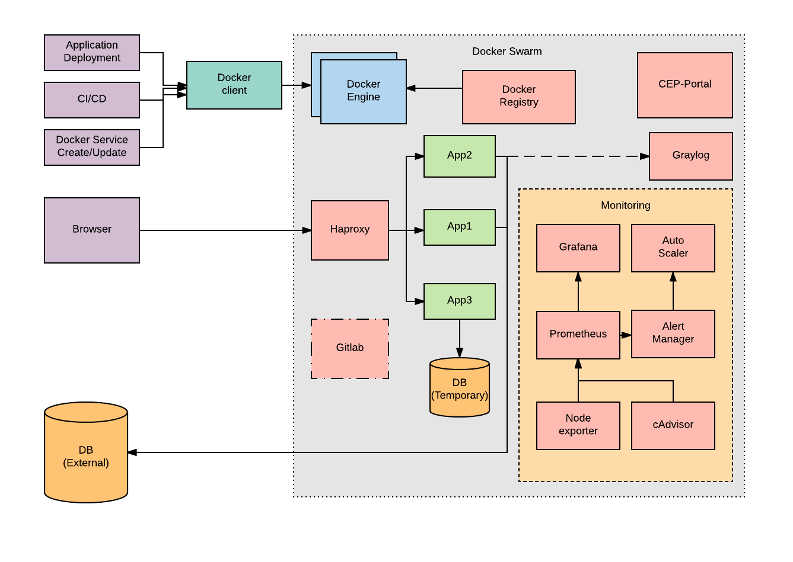

# CEP (Cloud Enablement Platform)
CEP leverages docker swarm cluster which allows us to orchestrate docker container workloads. This scripts automates CEP cluster formation along with addition/deletion of nodes in cluster. The CEP includes features like

### Docker-CE feature:
1. Dynamic URL Generation for services deployed in swarm 
2. Set of base docker images which applications can choose to use 
3. Docker Private Registry 
4. Service Health Checks 
5. Service monitoring
6. Service Logging
7. Service Auto-scaling [Experimental]

### Docker-EE feature:
Optional on top of CE features, Bring your own license!

8.  Docker-EE engine setup
9.  UCP setup
10. DTR setup
11. DTR Replica setup
12. Backup/Restore of UCP/DTR
 
## Architecture

## Getting Started 
Starting guide can be found [here](./docs/GettingStarted.md)

## Guides
All guides can be found [here](https://www.oecloud.io/guides)

## Steps covered
This scripts includes the following steps,

1.  Create self-signed SSL certificates for securing docker daemon. 
2.  Setup scalable volumes to be used with docker. ([more](./docs/docker_storage.md))
3.  Installation of docker package and its dependencies on all hosts
4.  Creation of docker swarm with the hosts 
5.  Creation of router that resolves URL to services. ([more](https://github.com/docker/dockercloud-haproxy))
6.  Setup of monitoring components. ([more](./docs/monitoring.md))
7.  Creation of private registry and pull/push base images.
8.  Installation of portal for swarm management. ([more](https://github.com/portainer/portainer))
9.  Setup of logging module. ([more](https://github.com/Graylog2/graylog2-server))
10. Installation of gitlab server. ([more](https://about.gitlab.com/features/))
11. Setup cronjob to cleanup orphan volumes, images, containers, networks and garbage collect private registry ([more](./docs/Cleanup_cronjob.md))
12. Setup Auto-scaling environment ([more](https://github.com/EdgeVerve/cep-auto-scaler))

At the end of running this script you have,
1. Private registry (v2 API) running at https://registry.<domain\>
2. Container management portal running at https://cep-portal.<domain\>
3. Monitoring graphs running at https://cep-monitoring.<domain\>
4. Logging service running on https://graylog.<domain\> [Optional]
5. Code repository Gitlab running on https://gitlab.<domain\> [Optional]
6. UCP running on https://ucp.<domain\> [Optional/EE feature]
7. DTR running on https://dtr.<domain\> [Optional/EE feature]

If your servers have private IP one can access by giving appropriate host entry. For public access, one can
put A-record for server ip for *.<domain\> and URL's can be accessed through it. 

## FAQ
Commonly faced issues and queries are given [here](./docs/faq.md).

## More information
Please visit [oeCloud.io](https://www.oecloud.io)

## License
The project is licensed under MIT License, See [LICENSE](./LICENSE) for more details.

## Contributing
We welcome contributions. Some of the best ways to contribute are to try things out, file bugs, and join in design conversations. 

### [How to contribute](./CONTRIBUTION.md)

### [Report an issue](https://github.com/EdgeVerve/cep-provision/issues)