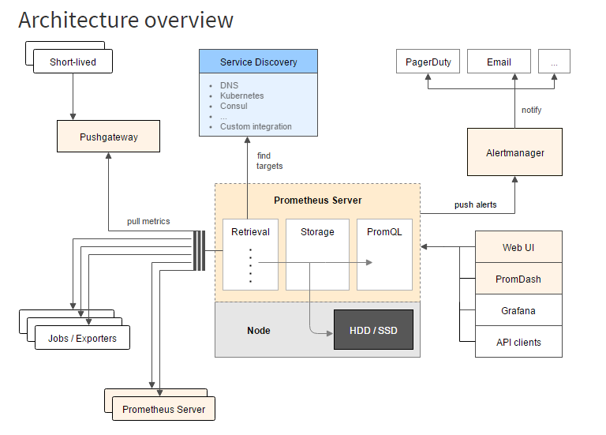

### Monitoring in docker

#### Pre-requisites:
1. Docker swarm should be configured

#### Monitoring of application
Monitoring of docker swarm application consists of three main components

1. Metrics exporters - These modules sits inside docker swarm cluster and exposes api for metrics.
      There are different exportes available for different components. For example, cAdvidor for 
      container metrics and node-exporter for server metrics.
      
2. Metrics storage - This module PULLS metrics from pre-configured metric exporter endpoint and stores
      in file based storage. From this storage one can query for metrics. For example, Prometheus can 
      be used as a metrics storage module.
      
3. Metrics dashboard - This module is used as a pre-configured dashboard to view the metrics pulled 
      from storage with given query. For example, Grafana can be used on top of Prometheus as dashboard.
      
4. Alerting - This module can be configured to send alerts based on limits on metrics pre-configured. The alert
      mechanism can be as e-mail,instant messaging or webhook. 